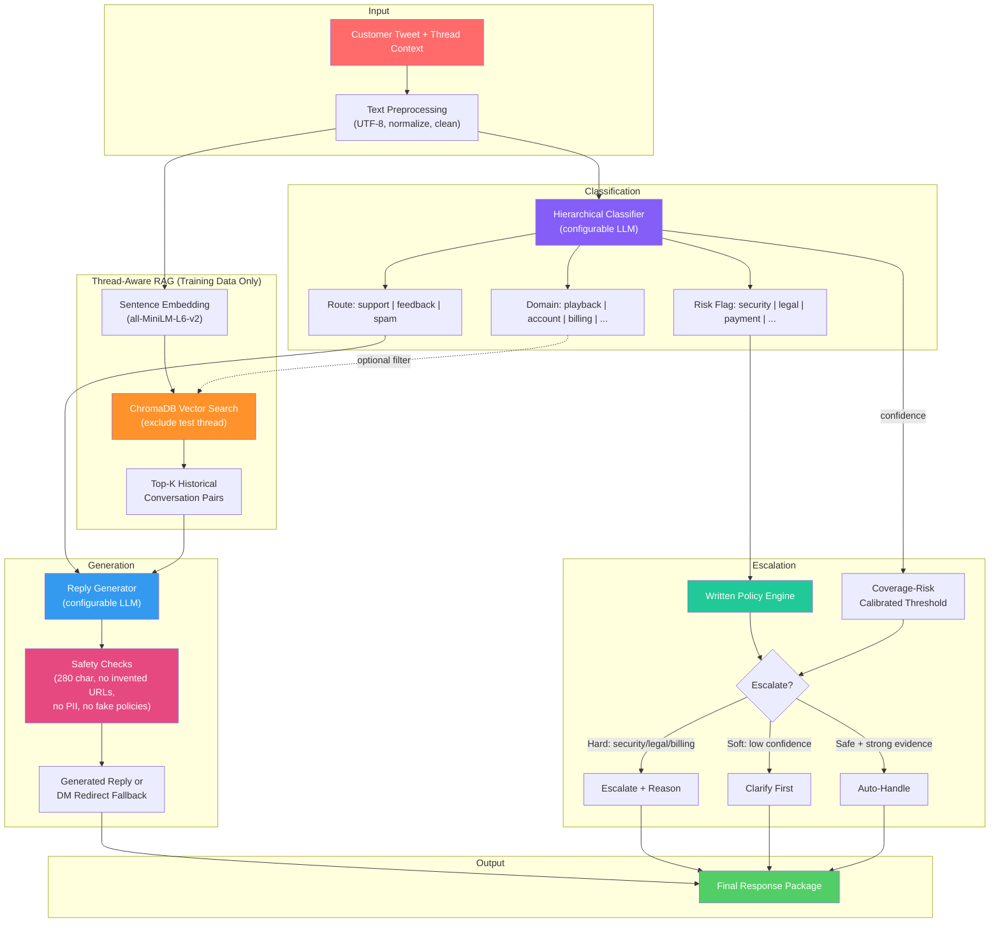
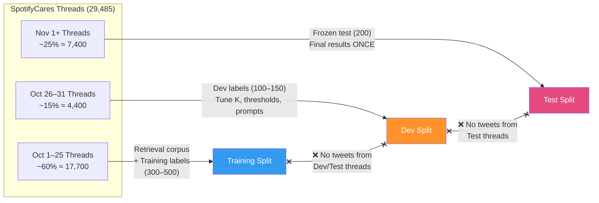

# Hiver SDE Intern — AI Customer Support Agent for SpotifyCares (Revised)

Build a **constrained triage and drafting agent** for SpotifyCares that classifies incoming support messages, drafts grounded initial responses using historical public support patterns, and decides whether to auto-handle or escalate — with rigorous proof of where it works, where it abstains, and why the headline number can mislead.

> [!IMPORTANT]
> **Core narrative:** *"I built a constrained drafting agent that only auto-handles well-supported, low-risk cases. I prove where it works, where it abstains, and why the headline number can mislead."*

## Data Audit Results (Full Dataset)

These numbers drive every downstream decision:

| Metric | Value |
|---|---|
| Total dataset rows | 2,811,774 |
| SpotifyCares outbound tweets | 43,265 |
| Total tweets in SpotifyCares conversations | 88,445 |
| Reconstructed threads | 29,485 |
| Threads ≥ 3 messages (real multi-turn) | 9,460 (32.1%) |
| Threads ≥ 5 messages (rich multi-turn) | 3,788 (12.8%) |
| DM redirect rate | 30.8% |
| Responses with troubleshooting steps | 9.7% |
| Responses with links (KB articles) | 50.5% |
| Responses with diagnostic questions | 45.0% |
| Temporal range | 95%+ in Oct–Nov 2017 |

> [!WARNING]
> **30.8% of SpotifyCares responses redirect to DM.** The public data does not contain actual resolutions for ~1/3 of conversations. The retrieval corpus is framed as *"historical public support patterns"* — not a knowledge base of verified resolutions.

## User Review Required

> [!IMPORTANT]
> **Brand: SpotifyCares** — 43K outbound tweets, diagnostic questioning pattern (45%), KB link referrals (50.5%). Not the "richest" for full resolution, but defensible for initial triage and drafting. The plan explicitly acknowledges the DM-redirect limitation.

> [!WARNING]
> **LLM Provider:** Now configurable (`LLM_PROVIDER` / `LLM_MODEL` env vars). Default recommendation is GPT-4o-mini for generation, GPT-4o for judge — but any capable model works. The reproduction path uses **cached outputs** so the evaluator doesn't need API keys for the standard path.

## Open Questions

1. **LLM Provider:** Which provider/model do you have access to? (The system is provider-agnostic by design.)
2. **Second annotator:** Can you recruit one person to label a 50-example subset for real inter-annotator agreement? If not, we document single-annotator + intra-annotator re-labeling.
3. **Banking77:** Use for classifier pre-training signal, or keep the project purely TWCS-based?

---

## Proposed Changes

### Step 1 — Data Audit & Fixed Split Manifest

#### [NEW] [`src/data_pipeline/extract_brand.py`](file:///c:/Coding/New%20folder/src/data_pipeline/extract_brand.py)
- Filter full 2.8M-row CSV to SpotifyCares conversations (both inbound + outbound)
- Streaming CSV reader — never loads full dataset into memory
- Output: `data/processed/spotify_raw.jsonl` (88K tweets)

#### [NEW] [`src/data_pipeline/thread_builder.py`](file:///c:/Coding/New%20folder/src/data_pipeline/thread_builder.py)
- Reconstruct conversation threads from flat tweet adjacency graph
- Algorithm: build `tweet_id → {children, parent}` → BFS from roots → order by timestamp
- **Branch handling:** Preserve all branches. Record branch count per thread. For retrieval, include all response variants. Document the rule explicitly.
- **Quality metrics:** Report dangling references (tweets referenced but not in dataset), circular references, orphan tweets
- Output: `data/processed/spotify_threads.jsonl` — each record: `{thread_id, messages: [{role, text, timestamp, tweet_id}], branch_count, length}`

#### [NEW] [`src/data_pipeline/text_cleaner.py`](file:///c:/Coding/New%20folder/src/data_pipeline/text_cleaner.py)
- Normalize @mentions → `@user`, preserve URLs (for grounding audit), handle HTML entities (`&amp;`, `&gt;`), normalize whitespace
- All I/O explicitly UTF-8
- Extract SpotifyCares agent initials from sign-offs (`/AY`, `/CP`)
- Preserve emojis (brand voice signal)

#### [NEW] [`src/data_pipeline/split_manifest.py`](file:///c:/Coding/New%20folder/src/data_pipeline/split_manifest.py)
- **Thread-level chronological split** (never split within a thread):
  - Training/Retrieval corpus: threads with earliest message before Oct 26, 2017 (~60%)
  - Development set: threads starting Oct 26–31, 2017 (~15%)
  - Frozen test set: threads starting Nov 1+, 2017 (~25%)
- Output: `data/splits/manifest.json` — `{thread_id: "train" | "dev" | "test"}` for every thread
- **Automated leak check:** Verify zero tweet overlap between splits. Verify zero thread overlap. Log and fail if violated.

> [!CAUTION]
> **Leakage Prevention Rule:** For every test tweet, the retrieval system MUST exclude (a) the tweet's own historical reply, (b) every message in the tweet's thread, from candidate results. This is enforced at retrieval time via thread_id filtering.

---

### Step 2 — Labels, Policy & Annotation Guide

#### [NEW] [`docs/taxonomy.md`](file:///c:/Coding/New%20folder/docs/taxonomy.md)
- Hierarchical classification schema:

```
Layer 1 — Route:      support | feedback | abuse/spam
Layer 2 — Domain:     playback | account | billing | content | app/device | how-to
Layer 3 — Risk Flag:  security | payment-dispute | legal | repeated-contact | unclear | none
```

- Each category includes: definition, 3+ annotated examples, boundary cases
- Explicit rules for multi-label situations (e.g., "app crashes on Bluetooth speaker" → domain: `app/device`, not `playback`)

#### [NEW] [`docs/escalation_policy.md`](file:///c:/Coding/New%20folder/docs/escalation_policy.md)
- Written policy — ground truth for escalation labels:

| Condition | Action | Rationale |
|---|---|---|
| Risk: `security` / unauthorized access | **Always escalate** → private | Account safety |
| Risk: `legal` | **Always escalate** → private | Legal exposure |
| Risk: `payment-dispute` | **Escalate** → human | Financial impact; no $ threshold (data doesn't provide values) |
| Risk: `repeated-contact` (≥ 5 unresolved exchanges) | **Escalate** → human | Patience exhausted |
| Risk: `unclear` / low calibrated confidence | **Clarify first**, then escalate | Avoid wrong auto-response |
| Route: `abuse/spam` | **Ignore / flag** | Not support |
| Route: `feedback` | **Acknowledge only** (auto) | No action needed |
| Domain: `playback` / `how-to` / `app/device` + strong evidence | **Auto-handle** | Known patterns |
| Domain: `content` | **Auto-handle** (acknowledge + link) | Limited agent ability |
| Domain: `account` without security flag | **Auto-handle** (standard help) | Documented recovery steps |

#### [NEW] [`docs/annotation_guide.md`](file:///c:/Coding/New%20folder/docs/annotation_guide.md)
- Step-by-step labeling instructions for annotators
- Label schema: `{route, domain, risk_flag, escalation_decision, escalation_reason, difficulty}`
- Worked examples for ambiguous cases
- Explicit "when in doubt" rules

#### [NEW] [`data/eval/training_labels.jsonl`](file:///c:/Coding/New%20folder/data/eval/training_labels.jsonl)
- 300–500 labeled examples from **training split threads only**
- Used for: TF-IDF/LR baseline training, few-shot prompt examples

#### [NEW] [`data/eval/dev_set.jsonl`](file:///c:/Coding/New%20folder/data/eval/dev_set.jsonl)
- 100–150 labeled examples from **dev split threads only**
- Used for: tuning retrieval K, escalation weights, confidence thresholds, prompt iteration

#### [NEW] [`data/eval/golden_test_set.jsonl`](file:///c:/Coding/New%20folder/data/eval/golden_test_set.jsonl)
- 200 labeled examples from **test split threads only**
- Stratified by route/domain/risk + adversarial slice (ambiguous, multi-issue, later-in-time)
- **Frozen**: touched exactly once for final reported results

#### [NEW] [`data/eval/labeling_notes.md`](file:///c:/Coding/New%20folder/data/eval/labeling_notes.md)
- Sampling methodology, labeling protocol, annotator information
- Intra-annotator consistency report (or inter-annotator if second labeler available)
- Honest framing: "single-annotator labels; consistency checked via re-labeling 50 examples after N days"

---

### Step 3 — Credible Non-LLM Baseline

#### [NEW] [`eval/baselines/trivial_baseline.py`](file:///c:/Coding/New%20folder/eval/baselines/trivial_baseline.py)
- **Classification:** Always predict most-frequent route + domain
- **Reply:** Fixed template: `"Hi there! We'd love to help with that. Could you send us a DM with more details? /AI"` (280 chars)
- **Escalation:** Never escalate (report both never + always variants)

#### [NEW] [`eval/baselines/simple_baseline.py`](file:///c:/Coding/New%20folder/eval/baselines/simple_baseline.py)
- **Classification:** TF-IDF + Logistic Regression, trained **only on `training_labels.jsonl`** (300–500 examples from training split)
- **Reply:** 1-NN retrieval — most similar historical response from training corpus, no LLM
- **Escalation:** Transparent rule-based — keyword match for security/legal/billing terms + thread length ≥ 5

> [!NOTE]
> The TF-IDF classifier trains exclusively on `training_labels.jsonl`. It is evaluated on `dev_set.jsonl` during development and on `golden_test_set.jsonl` exactly once for final results. No leakage.

---

### Step 4 — Minimal Full Agent

#### [NEW] [`src/intent/classifier.py`](file:///c:/Coding/New%20folder/src/intent/classifier.py)
- Hierarchical classification: Route → Domain → Risk flag
- LLM-based (configurable provider via `LLM_PROVIDER` / `LLM_MODEL` env vars)
- Returns: `{route, domain, risk_flag, confidence, reasoning}`
- Confidence calibration: **not raw logprobs** — measured on dev set, reported as coverage–risk curve

#### [NEW] [`src/retrieval/vector_store.py`](file:///c:/Coding/New%20folder/src/retrieval/vector_store.py)
- ChromaDB vector store of historical `{customer_msg, agent_response, thread_context}` triples
- **Only indexes training split threads** — dev/test threads excluded at index time
- Embedding model: `sentence-transformers/all-MiniLM-L6-v2` (free, reproducible)
- Metadata: `{thread_id, domain, timestamp}` for filtered retrieval

#### [NEW] [`src/retrieval/retriever.py`](file:///c:/Coding/New%20folder/src/retrieval/retriever.py)
- Query: embed incoming tweet → retrieve top-K similar historical conversations
- **Thread exclusion filter:** At query time, exclude all tweets from the queried tweet's thread (prevents leakage)
- Optional: filter by classified domain for more relevant results
- Default K=5, ablate K=3 and K=10 in evaluation

#### [NEW] [`src/generation/reply_generator.py`](file:///c:/Coding/New%20folder/src/generation/reply_generator.py)
- LLM prompt using retrieved historical conversations as context
- **Hard safety checks** (post-generation):
  - Character limit: 280 characters (Twitter limit, explicitly enforced)
  - No invented URLs: verify any URL in response exists in retrieved context
  - No PII requests in public: block responses asking for passwords, payment info, account details publicly
  - No fabricated policies: no refund/compensation promises not grounded in retrieved examples
  - No unauthorized account actions: don't claim ability to reset passwords, refund charges, etc.
- **Fallback:** When retrieval evidence is weak (low similarity scores), default to clarification/DM redirect rather than hallucinating a resolution

#### [NEW] [`src/generation/voice_guidelines.py`](file:///c:/Coding/New%20folder/src/generation/voice_guidelines.py)
- SpotifyCares brand voice rules extracted from data:
  - Greet by name if available
  - Emojis: sparingly (🙂, 🎵)
  - Sign with agent initials (`/AI`)
  - Concrete next steps ("Try logging out → restarting → logging back in")
  - Continued support offer ("Let us know how it goes")

#### [NEW] [`src/escalation/router.py`](file:///c:/Coding/New%20folder/src/escalation/router.py)
- Implements the written escalation policy (from `docs/escalation_policy.md`)
- Risk flag from classifier → deterministic policy rules for hard-escalate cases
- Confidence-based routing for soft cases: coverage–risk calibrated threshold from dev set
- Returns: `{decision: "auto_handle" | "escalate" | "clarify", confidence, reason, policy_rule_matched}`

#### [NEW] [`src/agent.py`](file:///c:/Coding/New%20folder/src/agent.py)
- Main orchestrator: `process_message(tweet, thread_context) → {route, domain, risk_flag, reply, escalation_decision, reason}`
- Chains all pipeline components
- API call caching (avoid re-processing during evaluation)
- Configurable via environment variables: `LLM_PROVIDER`, `LLM_MODEL`, `LLM_JUDGE_MODEL`, `RETRIEVAL_K`

---

### Step 5 — Evaluate and Ablate

#### [NEW] [`eval/metrics.py`](file:///c:/Coding/New%20folder/eval/metrics.py)
- **Classification metrics:** Accuracy, Macro-F1, Per-class F1, confusion matrix (per layer: route, domain, risk), Cohen's Kappa
- **Reply metrics (secondary):** BLEU-4, ROUGE-L, BERTScore — reported but explicitly disclaimed as weak measures
- **Escalation metrics:** Precision, Recall, F1, False Negative Rate (critical direction)
- All metrics with **bootstrap confidence intervals** (N=1000)

#### [NEW] [`eval/llm_judge.py`](file:///c:/Coding/New%20folder/eval/llm_judge.py)
- **Headline reply evaluation** — 5-dimension rubric:

| Dimension | Scale | Description |
|---|---|---|
| Relevance | 1–5 | Does the reply address the customer's actual issue? |
| Actionability | 1–5 | Clear next step for the customer? |
| Brand Voice | 1–5 | Matches SpotifyCares' warm, helpful tone? |
| Safety/Privacy | 1–5 | No invented policies, links, refunds, PII requests? |
| Evidence-Supportedness | 1–5 | Each recommendation supported by retrieved examples? |

- **Pairwise comparison:** For each test example, present retrieval-only baseline response AND RAG-generated response (position-randomized) → ask judge which is better + why. Report win/tie/loss rates.
- Uses structured JSON output for reliable parsing
- Judge model separate from generation model to reduce circular bias

#### [NEW] [`eval/judge_validation.py`](file:///c:/Coding/New%20folder/eval/judge_validation.py)
- Manually score 50 examples on all 5 dimensions
- Run LLM-judge on the same 50 examples (blinded)
- Report: Pearson correlation, Spearman rank, Cohen's weighted Kappa per dimension
- Honest disclosure: agreement level determines how much weight to place on judge scores

#### [NEW] [`eval/grounding_audit.py`](file:///c:/Coding/New%20folder/eval/grounding_audit.py)
- For 30–50 manual examples: trace each recommendation in generated reply back to specific retrieved example
- Report: % recommendations grounded vs. hallucinated
- Flag any invented URLs, policies, or account actions

#### [NEW] [`eval/safety_audit.py`](file:///c:/Coding/New%20folder/eval/safety_audit.py)
- Automated scan of ALL generated replies for:
  - Invented URLs (not present in retrieval results)
  - Fabricated refund/compensation offers
  - Public PII requests (passwords, payment details, account numbers)
  - Unauthorized account action claims
  - Policy claims unsupported by historical data
- Report: count and % of safety violations per category

#### [NEW] [`eval/coverage_risk.py`](file:///c:/Coding/New%20folder/eval/coverage_risk.py)
- Compute coverage–risk curve on dev set:
  - At each confidence threshold T: "agent auto-handles X% of cases (coverage) with Y% error rate (risk)"
- Select operating threshold for final system
- Visualize: plot curve, mark selected threshold

#### [NEW] [`eval/run_eval.py`](file:///c:/Coding/New%20folder/eval/run_eval.py)
- Full evaluation harness — runs all systems on frozen test set:
  - Trivial baseline → Simple baseline → Retrieval-only → Full RAG agent
- Ablations: K=3 / K=5 / K=10, with/without domain-filtered retrieval
- Produces: comparison tables, visualizations, failure examples
- Output: `results/` directory with JSON metrics + PNG plots

---

### Step 6 — Package Proof

#### [NEW] [`README.md`](file:///c:/Coding/New%20folder/README.md)
- **Reproduction guide** (< 15 min, one command):
  ```bash
  # Standard path — uses pre-computed embeddings + cached outputs
  pip install -r requirements.txt
  python run_reproduction.py  # No API key needed for cached path
  ```
- **Report** (max 6 pages) covering:
  1. Problem framing: what "good" means for SpotifyCares, what we chose not to build
  2. Data audit: real numbers, DM-redirect reality, temporal concentration
  3. Results vs. baselines (tables + plots) — observed results, not targets
  4. Failure analysis: top 5 failure modes with real examples and hypotheses
  5. **"What is misleading about my headline number?"** — mandatory section
  6. What I'd do with one more week
  7. Decision log reference

#### [NEW] [`decision_log.md`](file:///c:/Coding/New%20folder/decision_log.md)
- 10–15 non-obvious decisions:
  1. Brand selection (SpotifyCares — and the DM-redirect caveat)
  2. Hierarchical schema (Route/Domain/Risk) over flat intent list
  3. Thread-level chronological split (not random, not tweet-level)
  4. Written escalation policy before tuning
  5. Three separate label sets (train/dev/frozen test)
  6. "Evidence-supportedness" instead of "Accuracy" (no authoritative knowledge source)
  7. Safety audit as first-class evaluation dimension
  8. Coverage–risk curve instead of single confidence threshold
  9. Different models for generation vs. judge (circular bias mitigation)
  10. Configurable LLM provider (not committed to named models)
  11. Branch preservation (not just "keep first response")
  12. DM-redirect framing (public support patterns, not verified resolutions)
  13. Pairwise comparison as primary reply metric (not BLEU/ROUGE)
  14. What NOT to build (and why)

#### [NEW] [`run_reproduction.py`](file:///c:/Coding/New%20folder/run_reproduction.py)
- Single-command reproduction script
- Checks for cached outputs → uses them if available (no API calls needed)
- Falls back to live API calls with configurable provider
- Produces final results + report tables in < 15 min
- Validates all outputs against expected checksums

#### [NEW] [`config.py`](file:///c:/Coding/New%20folder/config.py)
- All configuration in one place:
  ```python
  LLM_PROVIDER = os.getenv("LLM_PROVIDER", "openai")
  LLM_MODEL = os.getenv("LLM_MODEL", "gpt-4o-mini")
  LLM_JUDGE_MODEL = os.getenv("LLM_JUDGE_MODEL", "gpt-4o")
  RETRIEVAL_K = int(os.getenv("RETRIEVAL_K", "5"))
  TWITTER_CHAR_LIMIT = 280
  ESCALATION_CONFIDENCE_THRESHOLD = float(os.getenv("ESCALATION_THRESHOLD", "0.6"))
  ```

---

## Architecture Diagram



## Data Split & Leakage Prevention



## Project Structure

```
hiver-spotify-agent/
├── README.md                          # Report + reproduction guide (< 15 min)
├── requirements.txt
├── config.py                          # Configurable LLM provider/model/params
├── run_reproduction.py                # One-command reproduction (cached path)
├── decision_log.md                    # 10–15 non-obvious decisions
│
├── docs/
│   ├── taxonomy.md                    # Hierarchical schema + examples
│   ├── escalation_policy.md           # Written policy (before tuning)
│   └── annotation_guide.md            # Labeling instructions
│
├── data/
│   ├── raw/                           # Instructions to download TWCS
│   ├── processed/
│   │   ├── spotify_threads.jsonl      # Reconstructed threads
│   │   └── spotify_embeddings/        # ChromaDB (training split only)
│   ├── splits/
│   │   └── manifest.json              # Thread → split assignment
│   └── eval/
│       ├── training_labels.jsonl      # 300–500 labeled (train split)
│       ├── dev_set.jsonl              # 100–150 labeled (dev split)
│       ├── golden_test_set.jsonl      # 200 labeled (test split, frozen)
│       └── labeling_notes.md          # Methodology + consistency report
│
├── src/
│   ├── data_pipeline/
│   │   ├── extract_brand.py
│   │   ├── thread_builder.py
│   │   ├── text_cleaner.py
│   │   └── split_manifest.py
│   ├── intent/
│   │   └── classifier.py             # Hierarchical Route/Domain/Risk
│   ├── retrieval/
│   │   ├── vector_store.py            # ChromaDB (training split only)
│   │   └── retriever.py              # Thread-excluded similarity search
│   ├── generation/
│   │   ├── reply_generator.py         # LLM draft + safety checks
│   │   └── voice_guidelines.py
│   ├── escalation/
│   │   └── router.py                 # Policy engine + calibrated confidence
│   └── agent.py                      # Main orchestrator
│
├── eval/
│   ├── metrics.py                    # Classification + reply + escalation
│   ├── llm_judge.py                  # 5-dimension rubric + pairwise
│   ├── judge_validation.py           # Human–judge agreement
│   ├── grounding_audit.py            # Trace recommendations → sources
│   ├── safety_audit.py              # Automated safety violation scan
│   ├── coverage_risk.py             # Coverage–risk curve
│   ├── baselines/
│   │   ├── trivial_baseline.py
│   │   └── simple_baseline.py       # TF-IDF/LR (trained on training_labels)
│   └── run_eval.py                  # Full harness
│
├── results/
│   ├── metrics/                     # JSON outputs
│   ├── plots/                       # Visualizations
│   ├── cached_outputs/              # Cached API responses for reproduction
│   └── failure_analysis/            # Top 5 failure modes
│
└── notebooks/
    ├── 01_data_audit.ipynb          # EDA + audit visualizations
    └── 02_results_analysis.ipynb    # Final results + plots
```

## Verification Plan

### Automated Tests
```bash
# 1. Verify data split integrity (zero leakage)
python -m pytest tests/test_split_integrity.py -v

# 2. Run thread reconstruction validation
python -m pytest tests/test_thread_builder.py -v

# 3. Run full evaluation harness on frozen test set (once, final)
python eval/run_eval.py --test-set data/eval/golden_test_set.jsonl --output results/

# 4. Validate LLM-judge agreement
python eval/judge_validation.py --human-scores data/eval/human_judge_scores.jsonl

# 5. Run safety audit on all generated replies
python eval/safety_audit.py --replies results/generated_replies.jsonl

# 6. Full reproduction test (< 15 min, cached path)
python run_reproduction.py --cached
```

### Manual Verification
- Trace 10 randomly-selected thread reconstructions against raw CSV to verify correctness
- Grounding audit: 30–50 replies manually traced to retrieved sources
- Spot-check 20 escalation decisions against written policy
- Verify reproduction: clone repo → `pip install` → `python run_reproduction.py` → results appear in < 15 min

### Results Framing

> [!IMPORTANT]
> All numbers below are **hypotheses, not observed results**. The final report will clearly distinguish between targets and evidence. We will report *"we observed X"*, not *"we expected X."*

| Metric | Trivial | Simple | Retrieval-Only | Full RAG (Hypothesis) |
|---|---|---|---|---|
| Route Accuracy | ~50% | ~75% | — | ~85–90% |
| Domain Macro-F1 | ~8% | ~50% | — | ~65–75% |
| LLM-Judge Avg (1–5) | ~2.0 | ~3.0 | ~3.3 | ~3.8–4.2 |
| Pairwise Win Rate vs. Retrieval-Only | — | — | baseline | ~55–65% |
| Safety Violations | 0% | 0% | 0% | < 2% (target) |
| Escalation Recall | 0% or 100% | ~50% | — | ~85%+ |
| Coverage @ 10% Risk | — | — | — | report curve |
